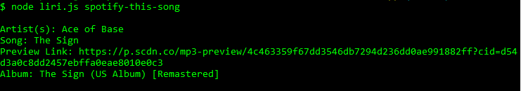

# liri-node-app

This is a simple node application called LIRI that takes in two arguments.

To use the application, you can choose from four different commands: "concert-this", "spotify-this-song", "movie-this", and "do-what-it-says".

When using "concert-this" type any band/artist into the CLI after "concert-this" and it will return data about upcoming concerts. The following information will be displayed for each event returned:
  * Venue Name
  * Venue Location
  * Date of Event
  

When using "spotify-this-song", type any song title into the CLI after "spotify-this-song" and it will return data on that song. The following information will be displayed:
  * Artist
  * Song Name
  * Preview link from Spotify
  * Album 
  

If no song name is entered, it will default to search for "The Sign" by Ace of Base.

When using "movie-this", type any movie title into the CLI after "movie-this" and it will return data about that movie. The following information will be displayed:
 * Title
 * Year
 * IMBD Rating
 * Rotten Tomatoes Rating
 * Country
 * Language
 * Plot
 * Actors
 

If no movie name is entered, it will default to search for the movie, Mr. Nobody.

The following npm packages are used in this project: Node-Spotify-API, Request, fs, Moment, and DotEnv.
I also used the Bands In Town and OMBD APIs to retrieve information.
